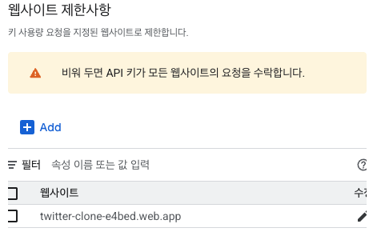

# twitter-clone-nomadcoders
nomadcoder 강의 기반 twitter clone coding (전반적인 Firebase 기능 Flow 중점)


- Firebase
Firebase는 앱과 게임을 빌드하고 성장시키는 데 도움이 되는 앱 개발 플랫폼입니다.
https://firebase.google.com/?hl=ko

- Cloud Firestore
Cloud Firestore는 글로벌 규모의 모바일 및 웹 앱용 데이터를 쉽게 저장, 동기화, 쿼리할 수 있게 해주는 NoSQL 문서 데이터베이스입니다.
https://firebase.google.com/products/firestore?hl=ko

- Auth
이메일/비밀번호 계정, 전화 인증, Google, Twitter, Facebook, GitHub 로그인 등을 지원하는 엔드 투 엔드 ID 솔루션을 제공합니다.
https://firebase.google.com/products/auth?hl=ko

- Cloud Storage
Cloud Storage는 사진, 동영상 등의 사용자 제작 콘텐츠를 빠르고 손쉽게 저장하고 제공할 수 있도록 설계되었습니다.
https://firebase.google.com/products/storage?hl=ko

----
- [1] Routing
- [2] Firebase Auth
   - Firebase SDK & Server <- Auth를 위한 모든 작업 수행 (쿠키, 토큰)
   - Login
        - 어플리케이션에 로그인 요청
        - Firebase 로그인 여부 확인 : Firebase가 요청된 Cookie와 Token을 활용하여 서버와 함께 확인
        - 로그인 완료 전까지 Frontend Loading Screen
        - 로그인 완료 

   - Firebase Setting
      - Authentication
         - Email & Password 활성화 및 Provider 설정 확인

         - 관련 함수
         Auth.authStateReady()
         초기 인증 상태가 해결되면 즉시 resolve되는 promise을 반환합니다. promise가 확인되면 현재 사용자는 유효한 사용자이거나 사용자가 로그아웃한 경우 null 일 수 있습니다.
         https://firebase.google.com/docs/reference/js/auth.auth.md?hl=ko#authauthstateready

         Auth.currentUser
         현재 로그인한 사용자(또는 null)입니다.

         Auth.signOut()
         현재 사용자를 로그아웃합니다.
         이것은 사용자의 ID 토큰을 자동으로 취소하지 않습니다.

         Auth.onAuthStateChanged()
         사용자의 로그인 상태 변경에 대한 관찰자를 추가합니다.

      - CreateUserWithEmailAndPassword
         (요구 : auth, email, password)
         - auth = firebase init 후 getAuth()를 통해 생성된 변수
         - email, password : 입력값
         - return Usercredential
         - userCredential 예시 Form
         
         ```json 
         {
            "operationType": "signIn",
            "providerId": null,
            "user": {
               "uid": "VA4J0AnIeRcs3PjrMLFieeZPm8v2",
               "email": "sadfas@naver.com",
               "emailVerified": false,
               "displayName": null,
               "phoneNumber": null,
               "photoURL": null,
               "isAnonymous": false,
               "metadata": {
                  "createdAt": "1758602424055",
                  "lastLoginAt": "1758602424055",
                  "lastSignInTime": "Tue, 23 Sep 2025 04:40:24 GMT",
                  "creationTime": "Tue, 23 Sep 2025 04:40:24 GMT"
               },
               "providerData": [
                  {
                  "providerId": "firebase",
                  "email": "sadfas@naver.com"
                  }
               ],
               "stsTokenManager": {
                  "refreshToken": "AMf-vBz-2IkcSgS...CnqIacA",
                  "accessToken": "eyJhbGciOiJSUzI1NiIsImtpZCI6...QNo5ChD6LyEqHTA",
                  "expirationTime": 1758606024482
               }
            },
            "_tokenResponse": {
               "email": "sadfas@naver.com",
               "expiresIn": "3600",
               "idToken": "eyJhbGciOiJSUzI1NiIsImtpZCI6...QNo5ChD6LyEqHTA",
               "kind": "identitytoolkit#SignupNewUserResponse",
               "localId": "VA4J0AnIeRcs3PjrMLFieeZPm8v2",
               "refreshToken": "AMf-vBz-2IkcSgS...CnqIacA"
            }
            }
         ``` 
      - Firebase Error (Authenticate)
         - 회원가입, 로그인 시 발생하는 에러
         - 오류 코드는 항상 체크할 것!
         ```json
         auth/email-already-in-use Firebase: Error (auth/email-already-in-use).
         ``` 
         - auth/wrong-password
         - auth/invalid-credential
         - 


- Firebase Hosting (정적 웹사이트 배포)
- firebase init
- 배포 위치 'dist'
- package.json 수정
   ```json
   "scripts": {
      "dev": "vite",
      ...
      "predeploy": "npm run build",
      "deploy": "firebase deploy"
   },
   ```
- npm dev deploy

- Firebase database security rules
  - 백엔드가 없을 경우, 리버스엔지니어링을 통해 해킹 가능
  - rule 설정을 통해 cloud Firestore의 접근 및 허용/거부 설정 가능

  -  기본 규칙 페이지 
      ```
      rules_version = '2';

      service cloud.firestore {
         match /databases/{database}/documents {
               }
      ```

   - 권한 부여 -> request.auth가 비어있지않을경우 (누구나 권한이 있을 경우)
      ```
      match / {document=**} {
         allow read: if request.auth != null
      }

      ```

   - 특정 문서에 권한 부여 -> request.auth가 비어있지않을경우 (누구나 권한이 있을 경우) // allow write일 경우, read 권한이 없어 아무런 트윗도 안보임
      ```
      match /tweets/{doc} {
         allow read: if request.auth != null
      }

      ```

   - 특정 문서에 권한 부여 및 쓰기 가능 -> \
      request.auth가 비어있지않을경우 (누구나 권한이 있을 경우) // allow write일 경우, read 권한이 없어 아무런 트윗도 안보임
      ```
      match /tweets/{doc} {
         allow read, create : if request.auth != null
      }

      ```
   - 허가받지않은 수정, 업데이트, 삭제에 대한 보호 (접근 유저와 문서보유유저 동일 시)\
      resource -> document의미
      ```
      match /tweets/{doc} {
         allow read, create : if request.auth != null
         allow delete, update : if request.auth.uid == resource.data.userId
      }

      ```

- Firebase storage security rules
   - 기본 형태
   ```
   rules_version = '2';
         service firebase.storage {
         match /b/{bucket}/o {

    ```

   - 규칙 추가 (auth여부 + 업로드 파일의 용량 2mb 이하)
   ```
      allow read : if request.auth != null
      allow write : if request.auth != null && resource.size < 2 * 1024 * 1024 && resource.contentType == "image/png"
   ```

- 이외 정보
   - Cloud Firestore 보안 규칙 : 
   https://firebase.google.com/docs/firestore/security/get-started

   - Cloud Storage 보안 규칙 :
   https://firebase.google.com/docs/storage/security

   - Storage 에 이미지 파일만 올릴 수 있도록 규칙 적용 \
   allow write에 request.resource.contentType.matches('image/.*') 추가하기
      ```
      allow write: if request.auth != null && request.resource.size < 2 * 1024 * 1024 && request.resource.contentType.matches('image/.*')
      ```

   - 읽기 권한 모두 허용 \
   allow read: if true;
 

- API Key Security
  - https://console.cloud.google.com/apis/credentials

  - 사용자 인증 정보 -> Browser Key
  - API 호출 방식을 변경할 수 있음
  - 허용 웹사이트 수정을 통해 API에 접근가능한 도메인을 막을 수 있음.
  - 개발시에만 localhost를 추가
   

